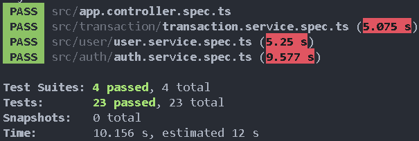
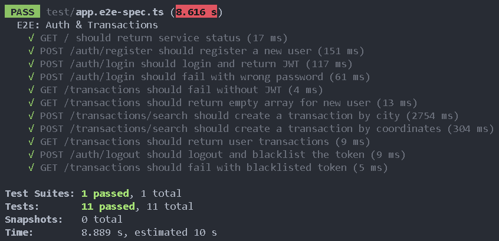

# Tyba Backend Engineer Test - Luis Felipe Torres

## Descripción General

Este proyecto es una API RESTful desarrollada en **Node.js** usando **NestJS** y **TypeORM**. Cumple con los requerimientos técnicos solicitados para el proceso de selección, implementando autenticación segura, endpoints protegidos, integración con servicios externos y pruebas automatizadas. Todo el entorno puede ser levantado localmente usando **Docker** y **docker-compose**.

---

## Endpoints y Ejemplos

### 0. Health Check
- **GET** `/`
- **Descripción:** Endpoint para verificar que el servidor está corriendo correctamente.
- **Respuesta:**
  - 200 OK: `Service is running!`

### 1. Registro de Usuario
- **POST** `/auth/register`
- **Body:**
```json
{
  "email": "usuario@ejemplo.com",
  "password": "claveSegura123"
}
```
- **Respuestas:**
  - 201 Created: `{ "access_token": "...", "user": { "id": "...", "email": "..." } }`
  - 409 Conflict: `{ "statusCode": 409, "message": "Email already exists", ... }`

### 2. Login de Usuario
- **POST** `/auth/login`
- **Body:**
```json
{
  "email": "usuario@ejemplo.com",
  "password": "claveSegura123"
}
```
- **Respuestas:**
  - 200 OK: `{ "access_token": "...", "user": { "id": "...", "email": "..." } }`
  - 401 Unauthorized: `{ "statusCode": 401, "message": "Invalid credentials", ... }`

### 3. Buscar Restaurantes Cercanos
- **POST** `/transactions/search` _(Requiere JWT)_
- **Body (por ciudad):**
```json
{
  "city": "Bogota"
}
```
- **Body (por coordenadas):**
```json
{
  "coordinates": "4.65,-74.05"
}
```
- **Respuestas:**
  - 201 Created: `{ "transaction": { ... }, "apiResult": { ... } }`
  - 401/403 Unauthorized/Forbidden: Si el JWT es inválido o está en blacklist

### 4. Historial de Transacciones
- **GET** `/transactions` _(Requiere JWT)_
- **Respuestas:**
  - 200 OK: `[ { "id": "...", "city": "...", "coordinates": "...", "date": "..." }, ... ]`
  - 401/403 Unauthorized/Forbidden

### 5. Logout
- **POST** `/auth/logout` _(Requiere JWT)_
- **Respuestas:**
  - 200 OK: `{ "message": "Logged out successfully", ... }`
  - 401/403 Unauthorized/Forbidden

---

## Implementación de los Requerimientos

### Registro de Usuario
- Endpoint `/auth/register` crea un usuario nuevo con email y contraseña encriptada (usando bcrypt).
- Valida que el email no exista previamente.
- Retorna un JWT firmado que incluye el id y email del usuario.

### Login de Usuario
- Endpoint `/auth/login` valida credenciales y retorna un JWT firmado.
- El JWT contiene el id y email del usuario.

### Buscar Restaurantes Cercanos
- Endpoint `/transactions/search` protegido por JWT.
- Permite buscar por ciudad o coordenadas. Cuando se busca por ciudad, se usa una API pública de autocompletado de ciudades para obtener las coordenadas de esta.
- En base a las coordenadas, consulta una API pública de restaurantes y retorna los resultados junto con la transacción almacenada.
- Se decidio retornar el resultado de la API externa junto con la transacción para facilitar el acceso a los datos, y que en el caso de cambiar de API externa, el endpoint siga funcionando sin necesidad de cambios en el codigo.

### Historial de Transacciones
- Endpoint `/transactions` protegido por JWT.
- Retorna todas las transacciones históricas del usuario autenticado.

### Logout
- Endpoint `/auth/logout` agrega el JWT a una blacklist en memoria, invalidando el token para futuros usos.
- Esto previene el uso del token después de hacer logout.

---

## Buenas Prácticas de Ingeniería
- **Autenticación segura:** Se implementa autenticación basada en JWT, asegurando que solo usuarios autenticados puedan acceder a los recursos protegidos. Las contraseñas de los usuarios se almacenan de forma segura utilizando hashing con bcrypt, evitando el almacenamiento de datos sensibles en texto plano. Además, se utilizan guardias personalizados para reforzar la seguridad en cada endpoint.
- **Variables sensibles:** Todas las variables sensibles, como claves secretas y credenciales de APIs externas, se gestionan exclusivamente a través de archivos `.env` y variables de entorno. Esto previene la exposición accidental de secretos en el repositorio y facilita la configuración segura en diferentes entornos.
- **Pruebas automatizadas:** El proyecto cuenta con una cobertura robusta de pruebas unitarias y de extremo a extremo (e2e), lo que garantiza la confiabilidad de la lógica de negocio y la integración de los módulos. Las pruebas permiten detectar errores rápidamente y facilitan la evolución del sistema sin temor a romper funcionalidades existentes.
- **Código modular y organizado:** La estructura del código sigue el principio de separación de responsabilidades, dividiendo la lógica en módulos, servicios, controladores y DTOs. Esto facilita la mantenibilidad, escalabilidad y comprensión del código por parte de cualquier desarrollador que se integre al equipo.
- **Validaciones:** Se emplea `class-validator` junto con pipes globales para validar y transformar los datos de entrada en todos los endpoints. Esto asegura que la API reciba únicamente datos válidos y reduce el riesgo de errores o vulnerabilidades por entradas maliciosas o incorrectas.
- **Manejo de errores:** El sistema proporciona respuestas HTTP claras y coherentes ante errores, utilizando excepciones personalizadas y mensajes descriptivos. Esto mejora la experiencia del desarrollador y del usuario final, facilitando la identificación y resolución de problemas.
- **Docker:** El uso de Docker y docker-compose permite levantar el entorno completo de manera rápida y reproducible, independientemente del sistema operativo o configuración local. Esto facilita la colaboración en equipo y la integración continua.
- **Comentarios y documentación:** El código está debidamente comentado, explicando las partes clave y las decisiones de diseño. Además, los endpoints están documentados en este README, lo que facilita la integración y el uso de la API por parte de otros desarrolladores o equipos.

---

## Pruebas
- Se implementaron **pruebas unitarias** para los servicios principales (`user`, `auth`, `transaction`).
  


- Se implementaron **pruebas e2e** para todos los flujos principales (registro, login, endpoints protegidos, logout, historial, búsqueda de restaurantes).
  


---

## Seguridad y Manejo de Secretos
- Todas las variables sensibles (JWT secret, claves de APIs externas, etc.) se manejan mediante variables de entorno (`.env`).
- No hay secretos ni contraseñas hardcodeadas en el repositorio.

---

## Autenticación y Guardias
- Se utiliza **JWT** para proteger los endpoints.
- Guardias personalizados (`JwtAuthGuard`, `LocalAuthGuard`) aseguran que solo usuarios autenticados accedan a los recursos protegidos.
- Logout implementado mediante blacklist de tokens.

---

## Estructura del Código
```
tyba-backend/
  src/
    auth/           # Módulo de autenticación
    user/           # Módulo de usuarios
    transaction/    # Módulo de transacciones y búsqueda de restaurantes
    config/         # Configuración y variables de entorno
    shared/         # Utilidades y decoradores
  test/             # Pruebas e2e
  docker-compose.yml
  Dockerfile
```

---

## Cosas a Mejorar
- Persistir la blacklist de tokens (actualmente en memoria, se pierde al reiniciar el servidor).
- Mejorar el manejo de errores y mensajes para el usuario final.
- Implementar paginación en el historial de transacciones.
- Agregar más pruebas de casos borde y de integración.
- Documentar la API con Swagger/OpenAPI.
- Mejorar la gestión de dependencias y modularidad para escalar a microservicios.

---

## Ejecución Local

1. Clona el repositorio y navega al directorio principal.
2. Copia el archivo `.env` dentro de la carpeta `tyba-backend` y configura tus variables.
3. En esa carpeta, ejecuta:
```powershell
docker-compose up --build
```
4. La API estará disponible en `http://localhost:3000/api/v1`.
